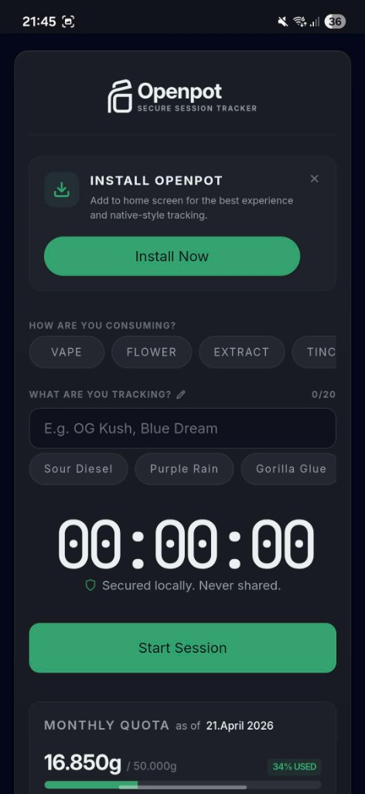
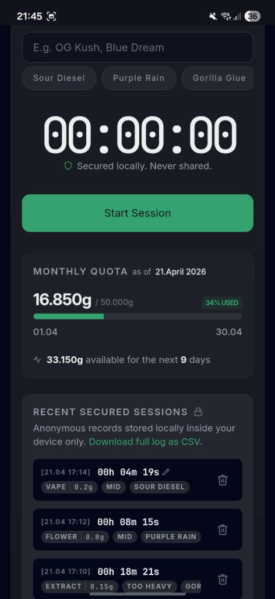
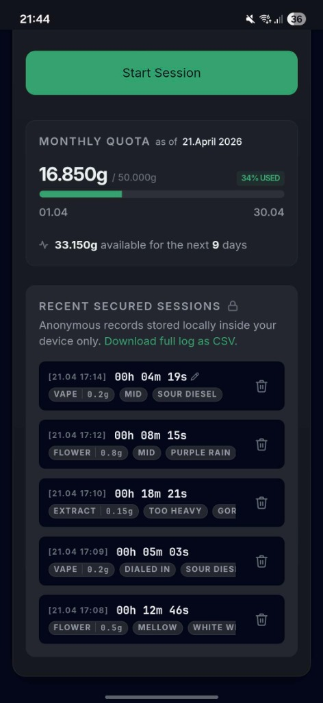
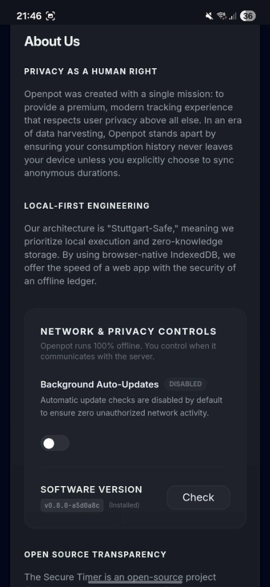

# Openpot Secure Timer 🛡️

**Free. Private. Secure.**

Openpot is a premium, privacy-first session tracker designed for sovereignty and anonymity. Built specifically to help users navigate the legal requirements of the **German Cannabis Act (CanG)**, Openpot provides a mathematically invisible way to track consumption while keeping all data strictly on-device.


## 🌟 Vision & Mission

Our mission is to provide a simple, intuitive, and 100% private tool for tracking monthly consumption. We believe that legal compliance should not come at the cost of your digital privacy. Openpot is designed to be your local-first companion, ensuring you stay within legal limits (e.g., the 50g monthly quota) without ever sharing your behavioral metadata with the cloud.

## ✨ Core Features

### 1. 100% Offline Sovereignty
From the moment you first load the application, Openpot downloads everything required to operate locally.
- **No Cloud Required**: After the initial load, the app works 100% offline.
- **Data Sovereignty**: Your data stays on your device and never leaves. Period.
- **User-Controlled Updates**: Future updates are fetched only when you explicitly initiate them.

### 2. Sophisticated Session Tracking
Log your sessions with precision and ease:
- **Methods \u0026 Amounts**: Quickly select your method and weight (e.g., *Flower | 0.8g*).
- **Product Identification**: Name your sessions (e.g., *"Purple Rain"*) for personal reference.
- **Interactive Timer**: Start, stop, and rate your sessions manually.
- **Detailed Logs**: Every entry captures a timestamp, method, amount, product name, rating, and duration.

### 3. Intuitive Quota Management (CanG Ready)
Stay informed and compliant without the math:
- **Automatic Aggregation**: All consumption is automatically summed for the current month.
- **50g Limit Tracking**: Visualize your progress against the 50g statutory limit.
- **Real-time Insights**: View your total consumption to date and exactly how much allowance remains until the end of the month.

### 4. Local Data Portability
Since everything is stored in your browser's IndexedDB, you have full control over your records:
- **CSV Export**: Download your entire history as a CSV file whenever you need a physical or external backup.

---

## 🙋‍♂️ Personal Note from the Author

I am incredibly proud of what Openpot has become, and I intend to continue refining it in my spare time. My goal is to build a tool that people genuinely enjoy using and find value in.

**Your feedback is essential.** If you find Openpot useful, or if you have ideas on how to make it better, please reach out or contribute!

## 🛠️ Tech Stack

- **Framework**: [Next.js](https://next.js.org/)
- **Styling**: [Tailwind CSS](https://tailwindcss.com/)
- **Database**: [IndexedDB](https://developer.mozilla.org/en-US/docs/Web/API/IndexedDB_API) (Local-first)
- **Language**: [TypeScript](https://www.typescriptlang.org/)
- **Packaging**: [pnpm](https://pnpm.io/)

## 🚀 Getting Started

### Prerequisites

- Node.js 18+
- pnpm

### Installation

1. Clone the repository:
   ```bash
   git clone https://github.com/openpot/openpot.git
   cd openpot/core
   ```

2. Install dependencies:
   ```bash
   pnpm install
   ```

3. Run the development server:
   ```bash
   pnpm dev
   ```

Open [http://localhost:3000](http://localhost:3000) with your browser to see the result.

## 📸 Screenshots

| Dashboard & Installation | Quota Tracking (CanG) |
| :---: | :---: |
|  |  |

| Session History | Privacy & Sovereignty |
| :---: | :---: |
|  |  |

### 🏗️ Production Build & Verification

To verify the production-parity static export locally:

1. Generate the static build:
   ```bash
   pnpm build:local
   ```

2. Serve the production output over local HTTPS:
   ```bash
   pnpm serve
   ```
The app will be available at `https://localhost:3005`.

### 📱 Testing on Mobile (Local HTTPS)

To test the PWA installation experience on a mobile device, you must serve the application over HTTPS. Openpot includes a custom launcher for this:

1. Identify your local IP address (e.g., `192.168.1.5`).
2. Run the secure dev environment:
   ```bash
   OPENPOT_DEV_HOST=192.168.1.5 pnpm dev:https
   ```
3. Trust the generated CA found at `.certs/openpot-local-dev-ca.crt` on your mobile device.
4. Access the app via `https://192.168.1.5:3000`.

## 🛡️ Security & Privacy

Openpot follows the **Stuttgart-Safe** standard:
- No remote fonts or scripts.
- No telemetry or analytics.
- No behavior-sharing APIs.
- No third-party cookies or localStorage tracking.

## 📄 License

This project is licensed under the **GNU Affero General Public License v3.0 (AGPL-3.0)**. We believe in software freedom—modifications to this software must remain open source.

---

Built with ❤️ for the sovereign community.
